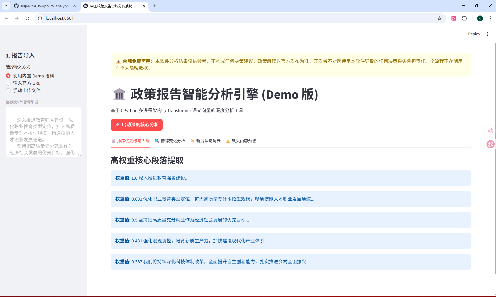

# 🏛️ 中国政策报告智能分析引擎 (Policy-Analyzer-Pro)

[](https://www.python.org/)
[](https://fastapi.tiangolo.com/)
[](https://streamlit.io/)
[](https://opensource.org/licenses/MIT)
[]()

## 📖 简介

基于 **CPython 多进程架构**与 **Transformer 深度语义向量**（`Chinese-RoBERTa`）开发的智能分析引擎。它专为解读两会、经济工作会议等官方政策报告而生，能自动测算历届报告的措辞变化、核心导向及新提法。

> *此项目旨在为您备考专升本计算机专业考核提供一个具备工程深度和 AI 落地价值的作品范例。*

## 📸 系统主界面展示



## ✨ 核心功能

* **🕵️‍♂️ 合规异步抓取**: 严格遵循官方 `robots.txt` 协议，利用 `httpx` 异步爬取网页，避免非法攻击或越权抓取。
* **⚡ 多进程 NLP 引擎**: 绕过 Python GIL 锁，利用 `ProcessPoolExecutor` 调度大模型进行多进程并行推理，压榨 CPU 多核性能。
* **🔍 措辞变化分析**: 基于 BERT 语义相似度算法，精确识别历届报告中对同一核心论述的“微调”和力度变化，测算“变化强度”。
* **✨ 新提法与词云**: 自动化提取“首次出现”的政策核心词汇，并生成基于词汇权重的热点词云图。

## 🛠️ 技术栈

| 模块 | 技术 | 描述 |
| :--- | :--- | :--- |
| **Frontend** | Streamlit | 响应式交互大屏，实时数据可视化 |
| **Backend** | FastAPI | 异步高性能 RESTful API，模型推理中枢 |
| **AI Model** | Chinese-RoBERTa-WWM-Ext | 中文深度语义理解，提取语义向量 |
| **NLP Lab** | Pandas, WordCloud, Jieba | 数据清洗、统计学分析与词云生成 |
| **Engine** | Multiprocessing | CPython 多进程调度，并行处理密集计算 |

## 📥 准备工作 (Prerequisites)

为了确保中文词云图正常生成，系统运行需要 **黑体（SimHei）** 字体支持。

1.  **自行下载 SimHei 字体**：请在网上搜索下载标准的 `simhei.ttf` 文件。
2.  **放入根目录**：将下载好的 `simhei.ttf` 文件放入项目的根目录（即与 `main.py` 在同一层级）。

## 🚀 快速启动

1.  **安装依赖**:
    ```bash
    pip install -r requirements.txt
    ```
2.  **启动后端引擎**:
    ```bash
    uvicorn main:app --port 8000
    ```
3.  **启动前端大屏**:
    ```bash
    streamlit run frontend/app.py
    ```

## 📃 开源协议

本 Demo 基于 [MIT License](LICENSE) 协议开源。